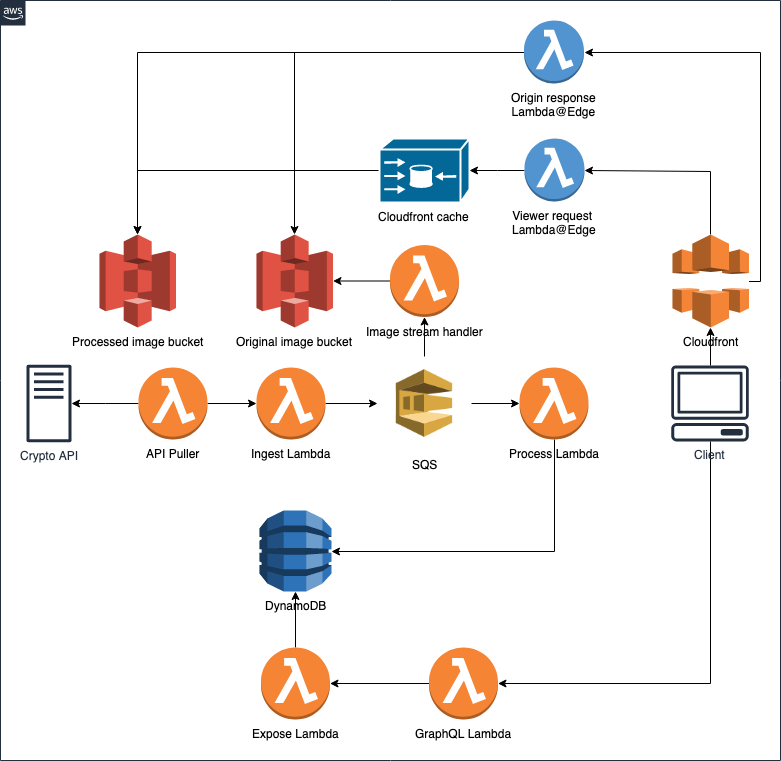

# Serverless GraphQL Workshop by Levi9

## Prerequisite

* Free tier AWS account
* Laptop

## Workshop outline

### Topics covered

1. Basic concepts of Cloud Computing
2. Introduction to AWS concepts (Regions, Availability Zones)
3. AWS Account and how to use it
4. Sample app architecture and deployment strategy
5. Identity & Access Management 
6. Computing - AWS Lambda functions and triggers
7. Queueing services - SQS, Kinesis 
8. Databases - AWS DynamoDB
9. Storage - S3 Bucket
10. Monitoring – Cloud watch
11. Caching - Cloud Front
12. Edge location computing - Lambda@Edge
13. Networking, VPC, Subnets
14. Serverless framework
15. Microservices architecture

### What are we going to build

Using [CryptoCompare API](https://min-api.cryptocompare.com/) we are going to fetch Crypto currencies data, pass data into SQS and store processed data in DynamoDB.
On the other side of system, this data will be exposed to client through GraphQL endpoint. 

API contains Crypto currency images that we are going to serve though CloudFront and Lambda@Edge. 

Client will be React application with Apollo client.

### What are we going to use to do it

* AWS Lambda
* SQS/Kinesis
* DynamoDB
* API Gateway
* IAM
* CloudFront
* CloudWatch
* CloudFormation
* S3 Bucket
* Lambda@Edge

Most of these will be managed through Serverless framework.

#### API used 
[CryptoCompare API](https://min-api.cryptocompare.com/)

### Systerm architecture



## Run locally 

To be able to run system locally without deploying to AWS, we need to mimic some services. 

To simulate SQS we are using ElasticMQ 

Run ElasticMQ server (Requires Java JDK)

```bash
java -jar assets/elasticmq-server-0.14.14.jar
```

To simulate DynamoDB locally we are going to use in memory DynamoDB. 

Download local DynamoDB 

```bash
sls dynamodb install
```

Run local DynamoDB 

```bash
sls dynamodb start --migrate
```

Run serverless offline - this will start server with API Gateway  

```bash
sls offline
```