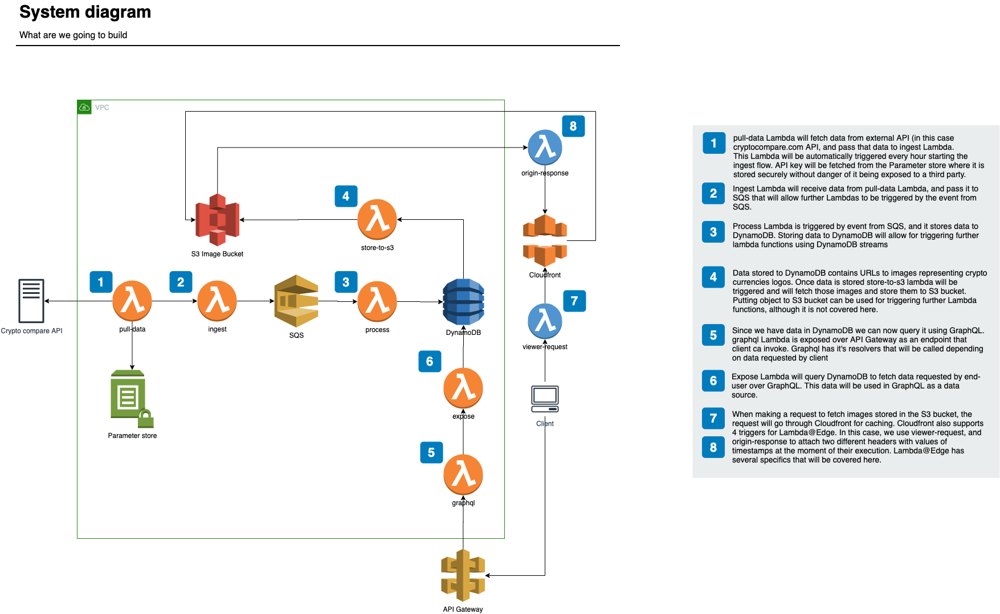

# Serverless GraphQL Workshop by Levi9

## Prerequisite

* Free tier AWS account
* Laptop
* Basic knowledge of JavaScript

## Workshop outline

### Topics covered

1. Basic concepts of Cloud Computing
2. Introduction to AWS concepts (Regions, Availability Zones)
3. AWS Account and how to use it
4. Sample app architecture and deployment strategy
5. Identity & Access Management 
6. Computing - AWS Lambda functions and triggers (SQS, DynamoDB Streams, API Gateway)
7. Queueing services - SQS, Kinesis 
8. Databases - AWS DynamoDB
9. Graphql introduction --> Intro to Graphql Workshop
10. Storage - S3 Bucket
11. Monitoring – Cloud watch
12. Caching - Cloud Front
13. Edge location computing - Lambda@Edge
14. Networking, VPC, Subnets
15. Serverless as a concept vs Serverless as a framework
16. Serverless framework
17. Running locally
18. Microservices architecture
19. Cost analysis

### What are we going to build

Using [CryptoCompare API](https://min-api.cryptocompare.com/) we are going to fetch Crypto currencies data periodically and keep it providing historical data to client over GraphQL API.  

API contains Crypto currency images that we are going to serve from S3 bucket though CloudFront and Lambda@Edge. 

Client will be React application with Apollo client.

### What are we going to use to do it

* AWS Lambda
* SQS
* DynamoDB
* API Gateway
* IAM
* CloudFront
* CloudWatch
* CloudFormation
* S3 Bucket
* Lambda@Edge
* AWS SSM

Most of these will be managed through Serverless framework.

#### API used 
To fetch data from [CryptoCompare API](https://min-api.cryptocompare.com/), create an account and obtain API key.

Once API key is obtained, put it to AWS SSM to store it securely

```bash 
aws ssm put-parameter --name API_KEY --value apikeyhere --type SecureString --key-id alias/aws/ssm --region us-east-1 --overwrite 
```

You will fetch it in the app by requesting it from AWS SSM Parameter Store

```javascript 
const ssm = new SSM();
const req: GetParametersRequest = {
    Names: ['API_KEY_{your-stage}'],
    WithDecryption: true,
};
const response = await ssm.getParameters(req).promise();
const apiKey = response.Parameters[0].Value;
```

### Systerm architecture

